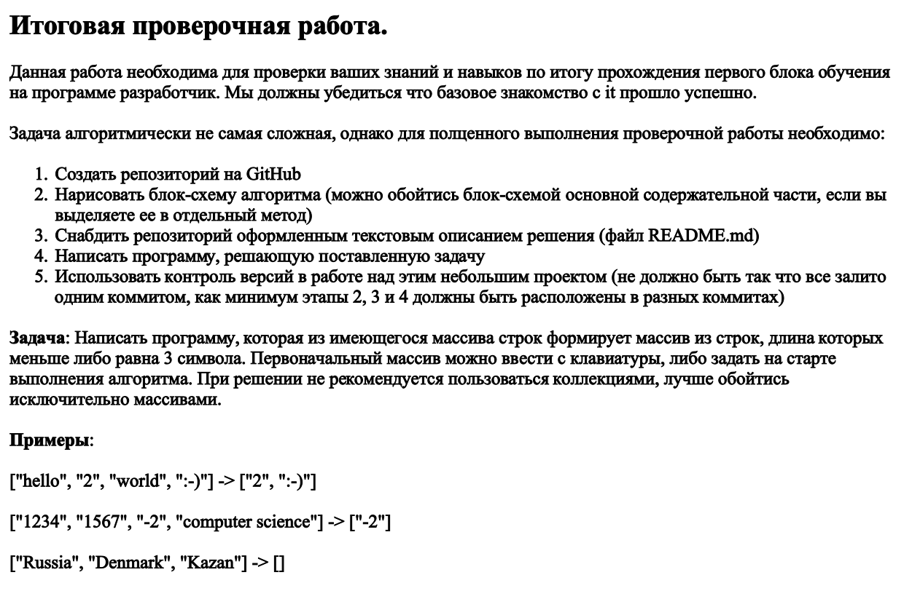
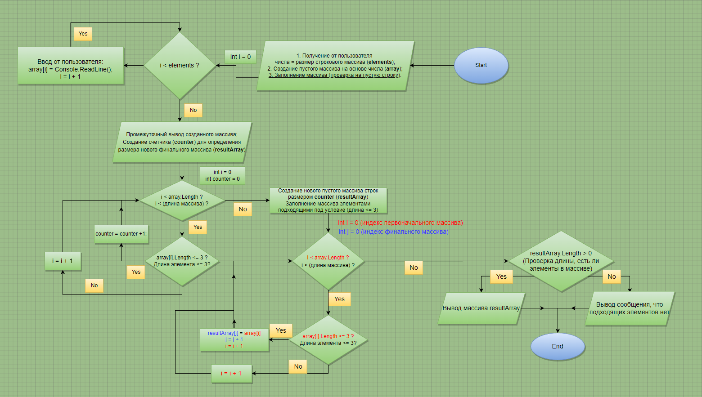

# **Описание задания:**
***
---
 

---
***

## *Блок-схема алгоритма решения задачи:*

 

---

## *Текстовое описание алгоритма выполнения программы:*

1. Принимаем от пользователя число, исходя из которого будет создан пустой строковый массив данной длины. Создаём массив;
2. Циклом от 0 элемента до значения < длине массива производим запрос от пользователя на введение элементов;
*  Стоит проверка на введение пустой строки. При попытке введения пустой строки программа просит произвести ввод заново;
3. После завершения цикла выводится созданный и заполненный массив с описанием количества элементов в нём;
4. * Создаётся переменная **счётчик** необходимая для определения сколько элементов в созданном массиве попадают под условие соответствия по длине каждого элемента меньшей или равной 3 символа. 
   * Циклом перебираем все элементы в созданном массиве и таким образом получаем значение, какой длины нужно создать новый финальный массив (результат состояния переменной **счётчик**), который в конце работы программы будет выводиться.
5. Создаём новый финальный массив используя значение переменной счётчика за длину.
6. Циклом проходим по всем элементам изначального массива и, если элемент массива соответствует условию (<= 3), то присваиваем этот элемент массиву финальному. Сдвигаем позицию индекса элементов обоих массивов на шаг вперёд, если не соответствует элемент условию, то сдвигаем только позицию индекса изначального массива.
7. Выводим полученный финальный массив. 😜
***
